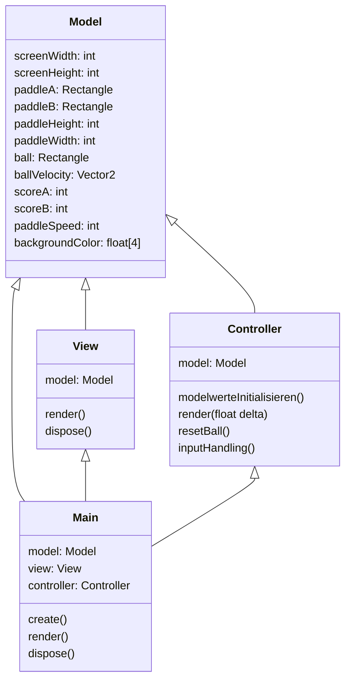

# ProjectCharlie

Dieses Projekt wurde von Constantin, Finn, David und Jakob erstellt, mit dem Ziel sich der Softwareentwicklung und deren Prozesse zu nähern.
Besonders wurde dabei auf die Zusammenarbeit im Team und die Prozesse im Hintergrund geachtet, welche einen reibungslosen Ablauf ermöglichen.
Deshalb handelt es sich bei diesem Spiel um ein sehr einfaches und klassisches Spiel, nämlich Pong.
> Das 1972 von Atari veröffentlichte Pong wurde zum ersten weltweit beliebten Videospiel und in den 1970er Jahren zunächst auf Geräten in Spielhallen bekannt. Es gilt als Urvater der Videospiele, obgleich schon zuvor Videospiele entwickelt worden waren.
>
> -- <cite>[Wikipedia](https://de.wikipedia.org/wiki/Pong)</cite>

Das Spiel lässt sich zu zweit spielen und hat kein Ende. Die Tasten für Spieler A sind `W` und `S` und für Spieler B die Pfeiltasten.

## Javadoc

Ein Teil der Vorgaben, war die ausseinandersetzung mit Javadoc. Anfänglich begangen wir den fehler, nicht sofort oder sehr sporadisch Javadoc zu schreiben. Das führte dazu, dass
wir am Ende in mehreren Iteration den Code nachkommentieren mussten, was sich als Umständlich erwies.

Der Javadoc lässt sich sehr einfach generieren mit `./gradlew javadoc`. Er ist dann unter `/core/build/docs` einzusehen.

## Gradle

Das Projekt bedient sich libgdx und damit auch [Gradle](https://gradle.org/) um Abhängigkeiten zu managen.
Der Gradle-Wrapper ist mit inkludiert und kann über `./gradlew` verwendet werden.
Die wichtigsten Befehle sind:

- `build`: builds sources and archives of every project.
- `html:dist`: compiles GWT sources. The compiled application can be found at `html/build/dist`: you can use any HTTP server to deploy it.
- `html:superDev`: compiles GWT sources and runs the application in SuperDev mode. It will be available at [localhost:8080/html](http://localhost:8080/html). Use only during development.
- `lwjgl3:jar`: builds application's runnable jar, which can be found at `lwjgl3/build/libs`.
- `lwjgl3:run`: starts the application.
- `test`: runs unit tests (if any).

Das Projekt, gliedert sich in 3 Unterteile. Den `core` Teil, welcher die gesamte selbstgeschriebene Logik des Programms enthält. Den `lwgjl` Teil, welche das Programm
für Desktop kompiliert und startet. Den `html` Teil, welcher das Programm als Web-Applikation kompiliert.

## Class diagram

Das Spiel wurde mit einer Variation des Model - View - Controller Schema entworfen.
Hierbei agiert das Model als dumme Klasse ohne irgendeine Kenntniss der anderen Klassen. Das Model
fungiert als reines Speichermedium. Währendessen kennen das View und der Controller beide das Model aber nicht den jeweils anderen.
Das View rendert eigenständig den Spielstand, basierend auf den Werten im Model, welche vom Controller manipuliert werden. Es findet sozusagen
eine indirekte Kommunikation statt.

