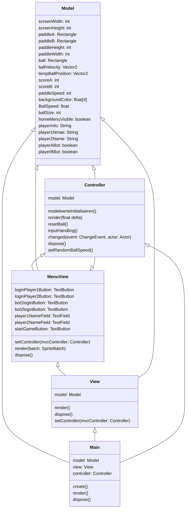

# ProjectCharlie

Dieses Projekt wurde von Constantin, Finn, David und Jakob erstellt, mit dem Ziel sich der Softwareentwicklung und deren Prozesse zu nähern.
Besonders wurde dabei auf die Zusammenarbeit im Team und die Prozesse im Hintergrund geachtet, welche einen reibungslosen Ablauf ermöglichen.
Deshalb handelt es sich bei diesem Spiel um ein sehr einfaches und klassisches Spiel, nämlich Pong.

Pong wurde in den 70er Jahren entwickelt und ist das erste erfolgreiche Videospiel. Es ist ähnlich wie Tischtennis: jeder Spieler hat einen Balken(Schläger), den er hoch und runter bewegen kann. Zudem gibt es auch einen Ball, der sich bewegt und von den Rändern des Spielfelds reflektiert wird. Wenn der Ball an dem Balken eines Spielers vorbeigeht, bekommt der andere einen Punkt. 
Im Frühjahr 1972 präsentierte die Firma Magnafox ihre von Ralph Baer entwickelte Magnafox Odyssey, die erste kommerzielle Spielkonsole. Bei dieser Präsentation spielte Nolan Bushnell zum ersten Mal dieses Ping-Pong Spiel. Als Bushnell wenig später Atari gründete, beauftragte er seinen noch neuen Angestellten Allan Allcon, zu Übungszwecken ein Ping-Pong-Spiel zu erstellen. Wie sich herausstellte, machte das Ping-Pong-Spiel so viel Spaß, dass Bushnell sich entschied, es zu veröffentlichen. Da der Begriff Ping Pong bereits geschützt war, einigte man sich darauf, das Spiel ganz einfach Pong zu nennen.
Als Magnavox von Pong erfuhr, informierten sie Atari darüber, dass für das Spielprinzip bereits Patente bestanden. Vor Gericht konnte Magnavox beweisen, dass Bushnell im Frühjahr 1972 deren Ping-Pong-Spiel gesehen und gespielt hatte. Ein Eintrag Bushnells im Gästebuch von Magnavox untermauerte deren Beweisführung. Atari wurde zur Zahlung von $700.000 zur Nutzung der Patente von Magnavox verurteilt. Für Atari war das jedoch eine gute Investition, da man bis 1983 weit über 8000 Pong-Münzautomaten verkaufte.
Heutzutage ist Pong nicht mehr so beliebt, da es sehr viel kompliziertere und spannendere Videospiele gibt, wobei es dennoch den Grundstein vieler Spiele gelegt hat.
Fun Fact: die ursprüngliche Version ist erst ab 18, da es nie von der USK geprüft wurde. 1999 wurde dann jedoch eine neue Version veröffentlicht, die nicht ab 18 ist.  

> Das 1972 von Atari veröffentlichte Pong wurde zum ersten weltweit beliebten Videospiel und in den 1970er Jahren zunächst auf Geräten in Spielhallen bekannt. Es gilt als Urvater der Videospiele, obgleich schon zuvor Videospiele entwickelt worden waren.
>
> -- <cite>[Wikipedia](https://de.wikipedia.org/wiki/Pong)</cite>

Das Spiel lässt sich zu zweit spielen und hat kein Ende. Die Tasten für Spieler A sind `W` und `S` und für Spieler B die Pfeiltasten.

## Hauptmenü

Das Hauptmenü ist der Einstiegspunkt in das Spiel. Hier müssen sich Spieler vor dem Spiel für ihre jeweilige Seite anmelden. Dies können sie bewerkstelligen, indem sie ihren Namen in das jeweilige
Textfeld eingeben und dann auf Login drücken. Sollte man nicht den Luxus von Freunden sich leisten können, so klickt man einfach auf ComputerLogin. Dann spielt der Computer für die jeweilige Seite.
Zuletzt startet man das Spiel durch drücken auf Start-Game. Hierdurch gelangt man in den Spielberreich.

## Spielberreich

Der Spielberreich umfasst mehrere Elemente. 
1. Die Paddles. Diese werden vom Spieler oder vom Computer gesteuert. Die Tasten für die Spieler sind W und S, sowie Up und Down.
2. Den Ball. Dieser befindet sich am Anfang und vor jedem Punkt in der Mitte des Spielfeldes. Er wird dann, nach einiger Zeit in eine beliebige Richtung mit leicht varierender Geschwindigkeit gestartet.
3. Die Punkte (großen Zahlen) zeigen die momentane Punktzahl für den jeweiligen Spieler.
4. Die Schrift in klein, zeigt den höchsten Punktestand, des jeweils angemeldeten Spielers über alle Spiele und Programstarts hinweg.

Aus dem Spielberreich kommt man mit der Taste ESC wieder zurück. Das Spiel an sich geht endlos, aber der Punktestand hört bei 99 auf.

## Javadoc

Ein Teil der Vorgaben, war die ausseinandersetzung mit Javadoc. Anfänglich begangen wir den fehler, nicht sofort oder sehr sporadisch Javadoc zu schreiben. Das führte dazu, dass
wir am Ende in mehreren Iteration den Code nachkommentieren mussten, was sich als Umständlich erwies.

Der Javadoc lässt sich sehr einfach generieren mit `./gradlew javadoc`. Er ist dann unter `/core/build/docs` einzusehen.

## Gradle

Das Projekt bedient sich libgdx und damit auch [Gradle](https://gradle.org/) um Abhängigkeiten zu managen.
Der Gradle-Wrapper ist mit inkludiert und kann über `./gradlew` verwendet werden.
Die wichtigsten Befehle sind:

- `build`: builds sources and archives of every project.
- `html:dist`: compiles GWT sources. The compiled application can be found at `html/build/dist`: you can use any HTTP server to deploy it.
- `html:superDev`: compiles GWT sources and runs the application in SuperDev mode. It will be available at [localhost:8080/html](http://localhost:8080/html). Use only during development.
- `lwjgl3:jar`: builds application's runnable jar, which can be found at `lwjgl3/build/libs`.
- `lwjgl3:run`: starts the application.
- `test`: runs unit tests (if any).

Das Projekt, gliedert sich in 3 Unterteile. Den `core` Teil, welcher die gesamte selbstgeschriebene Logik des Programms enthält. Den `lwgjl` Teil, welche das Programm
für Desktop kompiliert und startet. Den `html` Teil, welcher das Programm als Web-Applikation kompiliert.

## Class diagram

Das Spiel wurde mit einer Variation des Model - View - Controller Schema entworfen.
Hierbei agiert das Model als dumme Klasse ohne irgendeine Kenntniss der anderen Klassen. Das Model
fungiert als reines Speichermedium. Währendessen kennen das View und der Controller beide das Model aber nicht den jeweils anderen.
Das View rendert eigenständig den Spielstand, basierend auf den Werten im Model, welche vom Controller manipuliert werden. Es findet sozusagen
eine indirekte Kommunikation statt.

Die einzelnen Klassen interagieren ungefähr so miteinander:
Main ist die Klassse, welche alle anderen Klassen, mit ausnahme von MenuView, erstellt, startet, in relation zueinander setzt und regelmäßig updated.
Main beeinhaltet den "Main Loop", von welchem aus das ganze Program läuft. 
Die Klasse Model ist ein "dumme" Klasse. Sie kennt nur sich selbst und ist ein reiner Speicher für Variablen und Attribute. Ihre Anfangswerte, werden je nach Bedarf, entweder in der Klasse selbst
oder in der modelwerteInitialiseren() Methode vom Controller aus gesetzt. Die View Klasse kümmert sich um alles, was mit dem rendern zu tun hat. Während View primär für das Spielfeld zuständig ist,
managet es gleichzeitig die Klasse MenuView. Beide Klassen bedienen sich den Werten aus dem Model um das Fenster zu rendern. Die MenuView Klasse ist hier besonders, da sie sich eher am klassischen Model
View Controller Paradigma orientiert. Jegliche InputEvents für die Knöpfe oder TextFelder werden an den Controller weitergeleitet, welche dann diesen Input verarbeitet, statechanges im Model veranlasst und
sogar eine Response im MenuView setzt. Der Controller setzt sich allgemein mit der Hintergrundlogik des Spiels auseinander. Von der Physik bis zu Paddlebewegung macht er alles.
